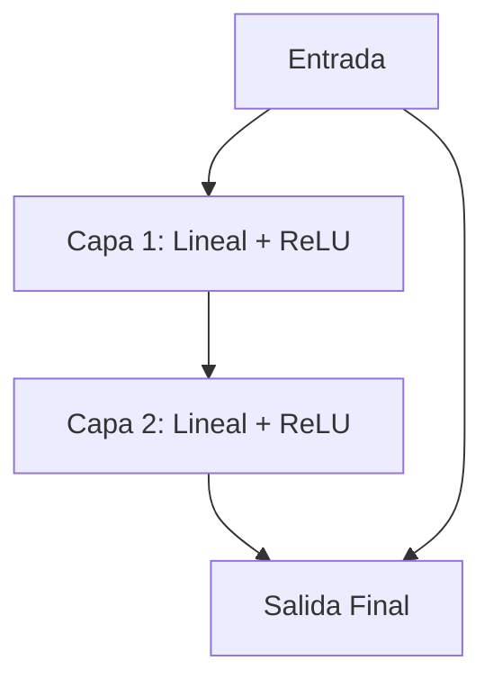

# Ejemplo 05: El Bug Inevitable

**De Cero a Ebiten: IA sin Magia Negra**
*(Capítulo 5 de 13: Por qué necesitamos Gonum)*

---

### Línea Argumental
Si llegaste hasta aquí desde el capítulo `04`, ya sabes el dolor que supone aplanar matrices y calcular índices a mano con `i*n_in + j`.
Este ejemplo existe para demostrar exactamente qué ocurre cuando nos equivocamos por un solo número al dimensionar los pesos de una capa lineal en Go estándar: **panic: runtime error: index out of range**.

### El Problema
En el mundo real del Machine Learning, las redes tienen miles de millones de parámetros. Si gestionamos la memoria y los índices matriciales a mano, pasaremos más tiempo depurando *panics* que entrenando la red.

### Siguiente Paso ->
[06-GonumMul](../06) - La solución profesional. Introducimos Gonum, la librería estándar *de facto* para álgebra lineal matemática en Go, que gestionará estas multiplicaciones de forma segura, acotada y optimizada.

---

**FASE 1: ACTIVACIÓN DEL SISTEMA 2 (Análisis Crítico)**

**Meta-Código:**
- El código implementa una red neuronal simple con capas lineales seguidas de ReLU.
- La función `Forward` aplica las capas en secuencia y registra el estado de salida.
- `applyLinear` realiza la multiplicación matricial y suma de sesgos.
- `applyReLU` aplica la función de activación ReLU.

**Trampa del Sistema 1:**
- El cálculo de `idx` en `applyLinear` es incorrecto: `i*n_in + j` no genera un índice válido para `weights` (que se espera tener `n_out * n_in` elementos).
- Esto puede causar index out of range y errores de cálculo.

**Visualización:**


**Socrático:**
¿Qué ocurre si el número de pesos en una capa no coincide con `n_out * n_in`? ¿Cómo podría el sistema 2 detectar esta inconsistencia de forma automática?

---

**FASE 2: ARQUITECTURA EN GO**

El código ya está en Go. Realizo un **Code Review** nivel Senior (Effective Go):

- **Buena Práctica:** El código está bien estructurado con funciones claras y separación de responsabilidades.
- **Mejora Sugerida:** Agregar una validación para asegurar que el número de pesos en cada capa sea `n_out * n_in` para evitar errores de indexación.
- **Código Go:** El uso de `math.Max` es correcto, pero podría usar `math.Max` en lugar de `math.Max(input[i], 0.0)` para mejorar la legibilidad.

---

**FASE 3: CODIFICACIÓN ELABORATIVA (Memoria)**

**Gancho Mnemotécnico:**
> Imagina que cada capa es una puerta con un mecanismo de llave (pesos) y un botón (sesgo). La puerta se abre solo si la llave es correcta (multiplicación), y si el botón está presionado (ReLU).

**Flashcards (Anki):**

Pregunta;Respuesta
```html
<pre><code>
func applyLinear(input, weights, bias []float64) []float64 {
	n_out := len(bias)
	n_in := len(input)
	result := make([]float64, n_out)

	for i := 0; i < n_out; i++ {
		sum := 0.0
		for j := 0; j < n_in; j++ {
			// El índice debe estar dentro de len(weights)
			idx := i*n_in + j
			sum += input[j] * weights[idx]
		}
		result[i] = sum + bias[i]
	}
	return result
}
</code></pre>
;Este código calcula la multiplicación matricial entre la entrada y los pesos, luego suma los sesgos. El índice `idx` se calcula como `i*n_in + j`, lo que puede causar errores si los pesos no tienen `n_out * n_in` elementos. <br><b>Nota:</b> Debe validarse que `len(weights) == n_out * n_in` para evitar index out of range.

```

**FASE 4: MODO RECOLECCIÓN**

```csv
Pregunta;Respuesta
```html
<pre><code>
func applyLinear(input, weights, bias []float64) []float64 {
	n_out := len(bias)
	n_in := len(input)
	result := make([]float64, n_out)

	for i := 0; i < n_out; i++ {
		sum := 0.0
		for j := 0; j < n_in; j++ {
			// El índice debe estar dentro de len(weights)
			idx := i*n_in + j
			sum += input[j] * weights[idx]
		}
		result[i] = sum + bias[i]
	}
	return result
}
</code></pre>
;El código realiza una multiplicación matricial entre la entrada y los pesos, luego suma los sesgos. El índice `idx` se calcula como `i*n_in + j`, lo que puede causar errores si los pesos no tienen `n_out * n_in` elementos. <br><b>Nota:</b> Debe validarse que `len(weights) == n_out * n_in` para evitar index out of range.
```