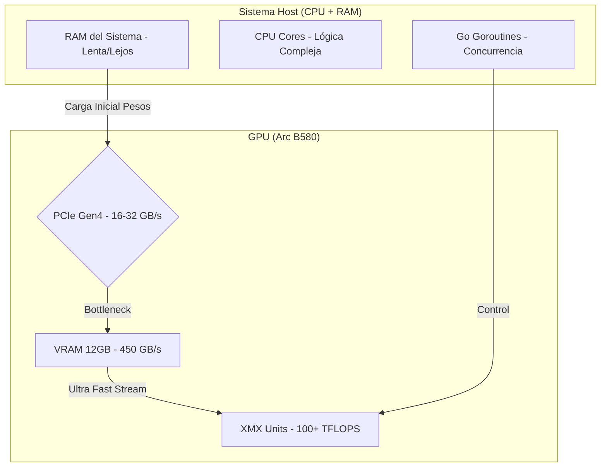
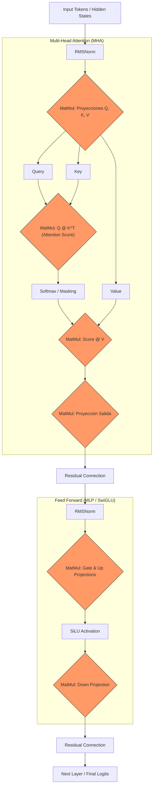

# Comparativa: SYCL vs Level Zero & Simulación LLM

Este directorio cierra el bloque de computación en GPU con una comparativa técnica y una estimación de recursos para modelos de lenguaje masivos.

## 1. Comparativa de Kernels

A continuación se analizan las dos formas de implementar el "corazón" de la multiplicación de matrices.

### SYCL (Alto Nivel / Modern C++)
El kernel se define como una lambda de C++ entregada a un `parallel_for`.

```cpp
h.parallel_for(matrix_range, [=](sycl::id<2> id) {
    int row = id[0];
    int col = id[1];
    float sum = 0.0f;
    for (int i = 0; i < N; i++) {
        sum += accessorA[row][i] * accessorB[i][col];
    }
    accessorC[row][col] = sum;
});
```
- **Ventajas**: Sintaxis amigable, seguridad de tipos, el compilador (`icpx`) gestiona la generación de código para el dispositivo automáticamente.
- **Uso**: Ideal para desarrollo rápido y portabilidad entre diferentes GPUs.

### Level Zero / OpenCL C (Bajo Nivel / C puro)
El kernel se escribe en un archivo separado (`.cl`) y se compila a SPIR-V.

```c
__kernel void matrix_multiply(__global const float* A, __global const float* B, __global float* C, int N) {
    int row = get_global_id(0);
    int col = get_global_id(1);
    // ... lógica de sumatorio ...
}
```
- **Ventajas**: Control total sobre el hardware, permite optimizaciones específicas de registros (usando `iga` o ensamblador GEN), carga dinámica de binarios.
- **Uso**: Motores de IA de alto rendimiento donde cada milisegundo cuenta.

---

## 2. Resultados de la Comparativa (Matriz 2048x2048)

Al ejecutar la comparativa en una **Intel Arc B580**, observamos una diferencia notable de rendimiento:

| Implementación | Tiempo GPU | Speedup (vs CPU Go) |
| :--- | :--- | :--- |
| **SYCL** | ~809ms | ~30x |
| **Level Zero** | **~126ms** | **~194x** |

### ¿Por qué Level Zero es más rápido?
En nuestro ejemplo básico:
- **SYCL** usa abstracciones de buffers y accessors que añaden un pequeño overhead de gestión en cada llamada. Además, el compilador genera un código genérico que, aunque eficiente, puede ser optimizado.
- **Level Zero** carga un binario **SPIR-V** pre-compilado y gestiona la cola de comandos de forma explícita. Al eliminar capas de abstracción, el "latido" entre la CPU y la GPU es mucho más corto.

---

## 3. Análisis de Memoria: Transformers en 12GB VRAM

Utilizando una GPU de **12GB** (como la B580), el límite de lo que podemos ejecutar está dictado por la arquitectura del Transformer y la técnica de cuantización.

### Desglose por Capa (INT4)
Para una capa típica de un Transformer (Q, K, V, O + MLP):
- **Hidden Dim 4096 (7B)**: ~0.09 GB por capa.
- **Hidden Dim 8192 (80B)**: ~0.37 GB por capa (4 veces más memoria).

### Capacidad Total vs Modelos Reales
Considerando el sistema y el **KV Cache** (memoria para el contexto):

| Configuración | Pesos + KV Cache (FP16) | ¿Cabe en 1 GPU? |
| :--- | :--- | :--- |
| **Llama-7B (INT4)** | ~5.00 GB | **SÍ** ✅ (Sobra espacio) |
| **Modelo H=8192** | ~16.00 GB | **NO** ⚠️ (Faltan 4GB) |
| **Modelo H=12288** | ~33.00 GB | **NO** ❌ (Necesita 3 GPUs) |

### Conclusión sobre Recursos
Para correr un modelo de **80B en INT4**, aunque el cómputo (TFLOPS) de la Arc B580 es potente, el límite real es la capacidad de memoria:
1. Necesitarías un **cluster de 4-5 GPUs** solo para cargar los pesos.
2. El rendimiento final estaría limitado por los **450 GB/s** de ancho de banda, resultando en unos **~11 tokens/segundo**.

---

## 4. El "Muro de Memoria": ¿Por qué no usar solo Go?

Una pregunta común es: *Si Go es tan bueno paralizando con Goroutines, ¿por qué no procesar el Transformer en la CPU?*

El problema no es la capacidad de cálculo, sino el **movimiento de datos**. 

### Arquitectura de Cuello de Botella



### Explicación del Bottleneck
1. **El Coste de Mover**: En inferencia de LLMs (decoding), por cada palabra generada, hay que leer **todos** los pesos del modelo (40GB en nuestro 80B INT4). 
2. **CPU (RAM)**: Si los pesos están en la RAM del sistema, la CPU sólo puede leerlos a unos **50-100 GB/s**. 
3. **GPU (VRAM)**: Al cargar el modelo en la VRAM, la GPU lee esos datos a **450 GB/s** (B580). 
4. **PCIe**: Si intentáramos "alimentar" a la GPU desde Go en tiempo real, el puerto PCIe (32 GB/s) se convertiría en un embudo insalvable.

**Conclusión**: Go es excelente para orquestar (como hacemos en este proyecto), pero el modelo **debe vivir dentro de la GPU** para que las unidades de cálculo no se queden "hambrientas" esperando datos de la memoria RAM.

---

## 5. Anatomía de un Bloque Transformer (MatMul-Centric)

Para entender cómo se relaciona nuestro código de multiplicación de matrices con la IA, aquí tienes una visión de "rayos X" de una sola capa de un Transformer (como Llama-3). Casi todos los bloques rectangulares son, en el fondo, una **MatMul**.



### ¿Dónde está el coste?
- **Pasos Críticos**: Los bloques en naranja son multiplicaciones de matrices masivas. 
- **Parámetros**: Los 80B de parámetros de los que hablábamos son, literalmente, los valores dentro de esas matrices (W_QKV, W_O, W_13, W_2).
- **GPU Loop**: Por cada "token" que genera el modelo, estos ~10-15 pasos de MatMul deben ejecutarse secuencialmente para **cada una** de las 32-80 capas del modelo. 

Por eso, optimizar el kernel de MatMul (como hemos hecho con SYCL y Level Zero) es el factor #1 que determina la velocidad de cualquier IA moderna.

## 5.1 Ejemplos Concretos de Tensores (Hidden Size = 4)

Para bajarlo a tierra, imaginemos un modelo ultra pequeño con una dimensión oculta (`d_model`) de **4**.

### 1. El Input (Hidden States)
Si estamos procesando el token "Gato", su representación numérica (vector) podría ser:
`Input = [0.1, 0.5, -0.2, 0.8]` (Matriz de 1x4)

### 2. La Matriz de Pesos (W_Query)
Esta matriz es la que "vive" en la GPU (los parámetros). Para `d_model=4`, es una matriz de 4x4:
```text
W_Query = [
  [ 0.1,  0.2, -0.1,  0.0 ],
  [ 0.0,  0.5,  0.3, -0.2 ],
  [ 0.4, -0.1,  0.0,  0.1 ],
  [-0.3,  0.2,  0.6,  0.5 ]
]
```

### 3. La Operación MatMul
Cuando nuestro kernel de SYCL o Level Zero se ejecuta, hace el producto: 
`Query = Input @ W_Query`

**Resultado**:
`Query = [ -0.21, 0.45, 0.62, 0.28 ]` (Un nuevo vector de 1x4)

### ¿Por qué Tensors? (3D/4D)
En la realidad no procesamos un token, sino un **Batch** (ej. 32 frases) de **Secuencias** (ej. 512 palabras). 
Nuestro kernel de MatMul pasaría de multiplicar `(1x4) @ (4x4)` a algo como:
`[Batch, Seq, Hidden] @ [Hidden, Hidden]` -> `[32, 512, 4096] @ [4096, 4096]`

Aquí es donde entra el poder paralelo de la Intel Arc: el kernel lanza **miles de hilos** simultáneos para calcular cada uno de los millones de productos individuales de esa matriz gigante en milisegundos.

---

---

## 6. Simulador Visual 2D

He incluido tres formas de visualizar el proceso:

### Opción A: Ventana Gráfica (Ebiten)
Muestra hilos (puntos naranja) moviéndose y rellenando la matriz resultado.
- **Ejecutar**: `cd visualizer && go run main.go`
- **Requisito**: `sudo apt install libx11-dev libxcursor-dev libxrandr-dev libxinerama-dev libxi-dev libxxf86vm-dev libgl1-mesa-dev libasound2-dev`

### Opción B: Terminal ASCII (Simulación de Paralelismo)
Versión animada en la terminal que muestra cómo los hilos de la GPU rellenan la matriz de salida de forma concurrente.
- **Ejecutar**: `cd visualizer/ascii/parallel && go run main.go`

### Opción C: Etapas Transformer & KV Cache
Simula los pasos lógicos (Proyecciones QKV, Atención, MLP) y el ahorro de cómputo del **KV Cache**.
- **Ejecutar**: `cd visualizer/ascii/transformer && go run main.go`

### Opción D: Simulador de Carga de Memoria & Contexto
Muestra en tiempo real cómo se llena la VRAM de 12GB (Tanque de memoria) a medida que crece el contexto.
- **Versión Gráfica (Ebiten)**: `cd visualizer/memory && go run main.go`
- **Versión Terminal (ASCII)**: `cd visualizer/ascii/memory && go run main.go`

---

## 7. El Concepto de "Multiplication Cache" (KV Cache)

¿Se pueden "cachear" las multiplicaciones? **Sí, y es vital para la IA.**

En un Transformer:
1. **K (Key) y V (Value)**: Los vectores resultantes de proyectar tokens pasados no cambian mientras se genera una frase.
2. **KV Cache**: Guardar esos resultados en VRAM evita repetir los trillones de multiplicaciones necesarias para procesar el contexto anterior en cada nuevo paso.
3. **Eficiencia**: Es una técnica de memoización masiva que hace que los LLMs sean usables, sacrificando memoria VRAM para ganar velocidad.

## 7.1 El Dilema del KV Cache: ¿Realmente compensa?

Es normal dudarlo: estamos "comiendo" gigabytes de VRAM preciosa solo para guardar resultados intermedios. Pero la alternativa es mucho peor.

### La Comparativa Fatal

| Métrica | Sin KV Cache | Con KV Cache |
| :--- | :--- | :--- |
| **Cómputo (Token 1000)** | Debes re-procesar los 999 tokens anteriores. | **Solo procesas el nuevo token.** |
| **Complejidad** | **Crecimiento Cuadrático O(n²)** | **Crecimiento Lineal O(n)** |
| **Latencia** | Cada palabra tarda más que la anterior (lentitud extrema). | Velocidad constante (fluido). |
| **Coste** | Uso masivo de TFLOPS (GPU ardiendo). | **Uso masivo de VRAM (GPU llena).** |

### Conclusión Técnica
Sin KV Cache, generar una respuesta de 2000 tokens en un Llama-3 **tardaría minutos o incluso horas** en lugar de segundos, porque la GPU tendría que repetir trillones de multiplicaciones idénticas una y otra vez.

El KV Cache es lo que convierte a un Transformer de un "juguete científico" a una **herramienta útil en tiempo real**. Estamos intercambiando **Memoria por Tiempo**. En el mundo de la IA actual, el tiempo es mucho más caro que los gigabytes.

---

## Cómo Ejecutar la Comparativa y Simulación

Asegúrate de haber compilado los ejemplos en las carpetas `06_oneapi` y `06_level_zero` primero.

```bash
source /opt/intel/oneapi/setvars.sh
go run simulation.go
```
